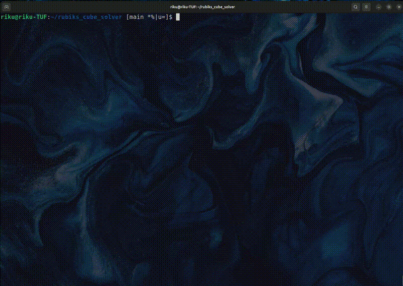

# Rubiks Cube Solver
This project is for proving the author's understanding in A* Algorithm and skills to apply the algorithms in non-trivial problems.
2 main tasks were completed.
[1] Generating the problem and its solution.
    At first, rubik's cube with the correctly placed faces are shuffled. The number of shuffles can be adjasted.
    The solver will try to place back all the faces as they were.
    As a result, it turned out that the solver is prone to stack at correcting the last 2 pieces.

You can watch a video demonstration of the solver in action below:



[2] Visualize the correctness of the solution.
It graphically shows the rubik's cube. The users can test the correctness of the calculated solution.

You can watch a video demonstration of the visualizer in action below:


## Table of Contents

- [Installation](#installation)
- [Usage](#usage)
- [Demonstration](#demonstration)
- [Report](#report)

## Installation

1. **Clone the repository:**
    ```sh
    git clone https://github.com/rabiken/rubiks_cube_solver.git
    cd rubiks_cube_solver
    ```
    You might have to run the following commands to install SFML:
    ```bash
    sudo apt update
    sudo apt install libsfml-dev
    ```

## Usage

1. **Build the project:**
    ```
    make all
    ```

2. **Run the program:**
   *Run the Problem Generator and Solver*
    ```
    ./main
    ```
   *Run the Rubik's Cube Visualizer*
   ```
   ./visualizer
   ```

## Demonstration
**Solver's Demo**
[]

**Visualizer's Demo**
[]

## Report
You can find the detailed report of this project in the following PDF file:
[rubikscube_report.pdf](rubikscube_report.pdf)
